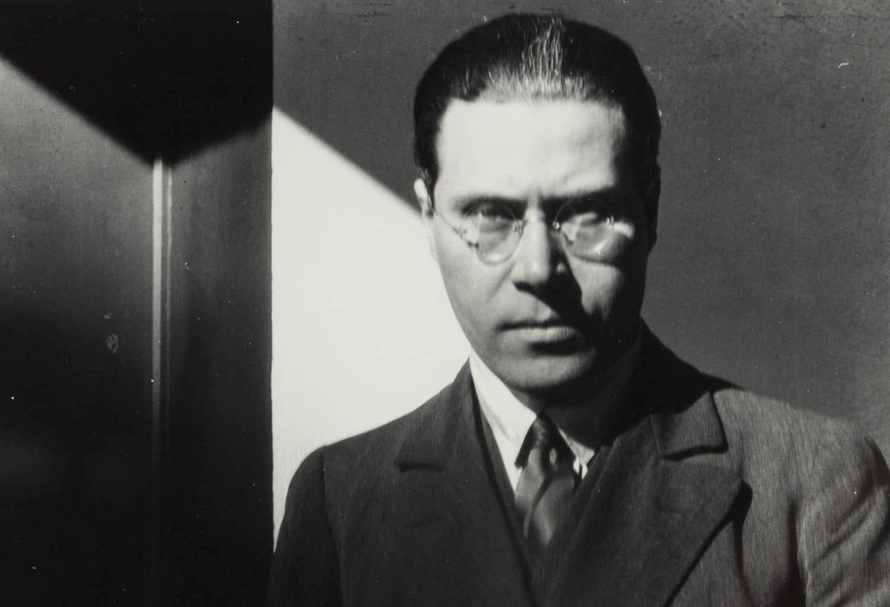
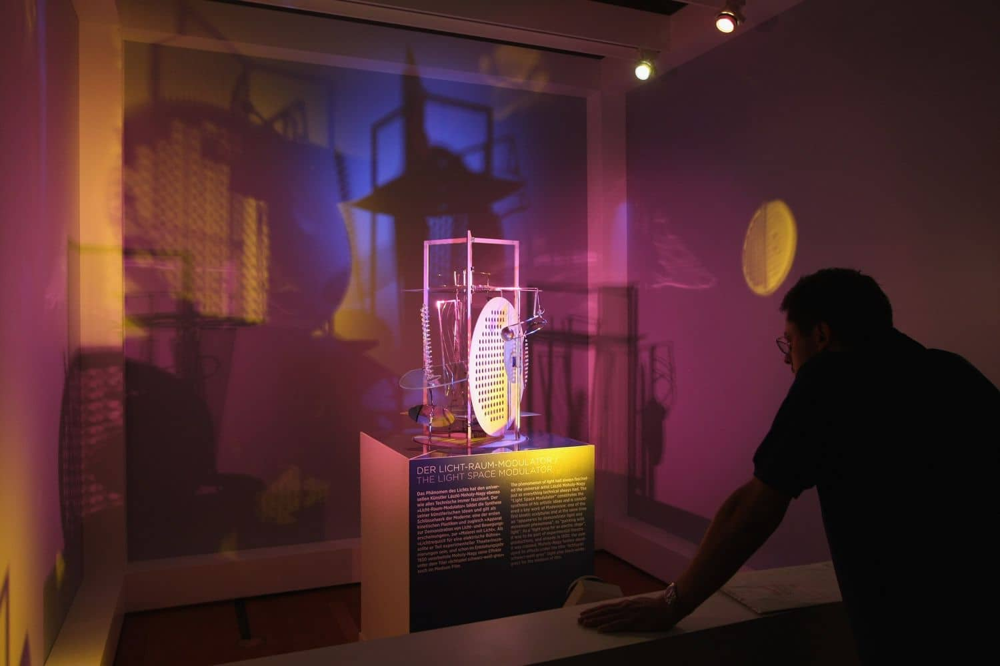

Asıl adı László Weisz Moholo-Nagy olan László, ressam, desinatör, fotoğrafçı, akademisyen ve teorisyen Macar-Amerikalı bir sanatçıdır.

20 Temmuz 1895′de Macaristan Bácsborsód'da Yahudi-Macar bir ailenin çocuğu olarak dünyaya geldi. Babası kendisini ve üç kardeşini terk ettikten sonra annesiyle birlikte tek ebeveyn olarak büyüdü. ***Babası kendilerini terkettiğinde ailesini destekleyen, kendisini ve kardeşlerini büyüten, avukat dayısının soyadı olan Nagy ile değiştirmiştir.*** Ortaokul ve liseyi Szeged şehrinde okudu. László aslında şair olmak istiyordu ve bu doğrultuda yerel gazetede bazı yazılar yayınlıyordu. Bir yandan hukukla ilgilenen László bu dönemde I. Dünya Savaşı'na katıldı.

Avusturya-Macar ordusundan Ekim 1918'de terhis ettikten sonra, Macar fovist sanatçı Róbert Berény'nin özel sanat okuluna katılmıştır. Resmî bir görevi olmamasına rağmen, 1919'da deklare edilen Macar Sovyet Cumhuriyeti'nin destekçisi olmuştur. Kasım ayında Viyana'ya gitmek için Szeged'den ayrılmadan önce, çalışmalarını kapsayan bir sergi gerçekleştirilmiştir. 1920 yılının başında ise Berlin'e doğru yola çıkmıştır.

## Bauhaus Yılları ve Alman Kariyeri

Alman mimar Walter Gropius, László'yu ünlü **Bauhaus** okulunda öğretmenlik yapmaya davet ettikten sonra László 1923 yılında temel kurs eğitmeni olarak Bauhaus'da çalışmaya başladı. ***László'nun yükselişi, okulun endüstriyel tasarım yönündeki dışa vurumculuk ve hareketle ilişkisinin sonu olup, asıl amacındaki gibi bir tasarım ve endüstriyel entegrasyon okulu olmasına doğru yön verdi. Bu sayede Bauhaus, László'da dahil olmak üzere sanatçılarının çok yönlülüğü ile bilinmeye başlandı.***

Kendini öncelikle bir ressam olarak görse de odaklandığı ana dallardan biri fotoğrafçılıktı. Kariyeri boyunca fotoğraf, tipografi, heykel, resim, baskı teknikleri ve endüstriyel tasarım alanlarında uzmanlaştı.

## Yeni Başlangıçlar

László, 1928'de Bauhaus'tan istifa etti. Berlin'de kendi tasarım stüdyosunu kurdu ve film, sahne tasarımı üstüne çalıştı. 1930'ların başındaki en önemli çalışmalarından biri **"Işık Uzay Modülatörü'nü"** tasarlamaktı. Yansıtıcı metal kullanan kinetik bir heykel ve yakın zamanda icat edilen Pleksiglas kullanıştır. Neredeyse beş fit yüksekliğinde duran nesne, başlangıçta tiyatrolarda ışık efektleri yaratmak için kullanılmak üzere tasarlanmıştı, ancak kendi başına bir sanat eseri olarak işlev görüyor.

1937′de ABD’de Chicago’ya yerleştikten sonra orada kuru­lan Yeni Bauhaus'un yöneticiliğini üstlendi. Macar asıllı ressam Gyorgy Kepes ile birlikte **Institute of Design'ı** kurdu. Faaliyetlerine devam ederken 1945'te László'ya lösemi teşhisi konuldu. László 24 Kasım 1946'da lösemiden hayatını kaybetti.

*Bu makale temel tasarm II dersi, araştırma ödevi için yazılmıştır.*

Kaynakça: [nishgt-posts archive](https://github.com/nishgt/nishgt-posts/blob/master/2021-04-05-laszlo-moholy-nagy/kaynakca.txt)

Kardelen Büyük

