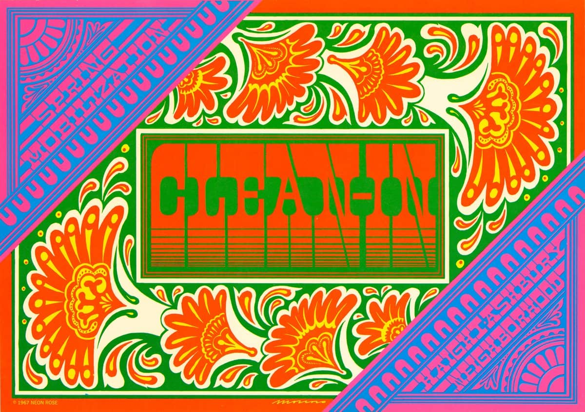

1936'da İspanya'da doğan Victor Moscoso, Yale Üniversitesi Sanat Okulu'na gitmeden önce Cooper Union Sanat Okulu'nda sanat eğitimi aldığı New York Brooklyn'de büyüdü. Yale'de, renk teorileri Moscoso ve psychedelic posterin gelişimi üzerinde önemli bir etkiye sahip olan modern renkçi Joseph Albers ile çalıştı. Moscoso, daha sonra MFA derecesini aldığı San Francisco Sanat Enstitüsü'ne katılmak için 1959'da batıya taşındı.

Moscoso'nun psychedelic poster sanatına olan ilgisi, Wes Wilson'ın Family Dog için hazırladığı Paul Butterfield posterini görünce alevlendi. Victor Moscoso, San Francisco'nun "Big Five" saykodelik afiş sanatçılarından ilk olarak New York'taki Museum of Modern Art'ta sergilenmiştir. Moscoso, poster sanatında 'psychedelic' etki yaratmak için titreşen renklerin kullanımına öncülük etti. Çalışmaları Londra'daki Victoria and Albert Müzesi'nde ve Kongre Kütüphanesi'ndedir. Onun Neon Gül posterlerin serisi saykodelik afiş dönemin taç mücevherleri biridir.

## 1967 itibarıyla, Victor Moscoso bir dönüşüm geçirdi.

1967 itibarıyla, Victor Moscoso bir dönüşüm geçirdi; akademik eğitimini bir kenara bırakmak zorunda kaldı ve “Bunu yapmanın yollarından biri, okulda öğrendiğim tüm kuralları tersine çevirmekti... Örneğin, bana harflerin her zaman okunaklı olması gerektiği söylendi, bu yüzden şunu söylemek için etrafımı çevirdim: Yazı mümkün olduğunca okunaksız olmalıdır. Bir başka kural da, bir posterin mesajını hızlı ve basit bir şekilde iletmesiydi. Ben de dedim ki: "Bir poster sizi olabildiğince uzun süre asmalı. Bir diğeri ise: Titreşimli renkler kullanmayın; gözleri tahriş ederler. Ben de dedim ki: Mümkün olduğunca canlı renkler kullanın. Sonuçta, müzisyenler amplifikatörlerini kulak zarlarınızı üfleyecekleri noktaya çeviriyorlardı. Gözbebekleriyle eşdeğerini yaptım.. "

Bu yüzden öğrendiğim her şeyi tersine çevirdim ve bunu yaptıktan sonra yerine oturdu. Sonra okulda öğrendiğim her şey benim için çalışmaya başladı. Kimsenin yapamadığı titreşimli bir renk seçebilirim... Sadece renk tekerleğinin karşısındaki renkleri kullanmak değil. Yoğunluk eşit olmalıdır. Değerin eşit olması gerekir, böylece gözünüz hangisinin diğerinin önünde olduğunu bilemez... Gözlerin sınırlı. Bu yüzden hareketli görüntüleri görebilirsiniz. Hareketli görüntüler hareket etmiyor. Onlar sadece bir sürü hareketsiz resim. Ancak gözlerimizin sınırlılığından dolayı hareket ediyor gibi görünüyorlar... "

Profesyonel başarı, San Francisco'nun dans salonları ve kulüpleri için oluşturulan psychedelic rock and roll poster sanatıyla geldi. Moscoso'nun Avalon Balo Salonu'ndaki Aile Köpeği dans konserlerine yönelik posterleri ve Matrix için hazırladığı Neon Rose posterleri, 1967 Aşk Yazında uluslararası ilgi topladı. Moscoso'nun poster çalışması Jerry Garcia, Bob Weir, Herbie Hancock, Jed Davis ve David Grisman gibi müzisyenler için albüm kapakları içeriyor.

Bir sonraki yazımda görüşmek üzere hoşça kalın, sağlıcakla kalın.

Kaynakça: [nishgt-posts archive](https://github.com/nishgt/nishgt-posts/blob/master/2021-04-08-victor-moscoso/kaynakca.txt)

Sümeyye Ütnü