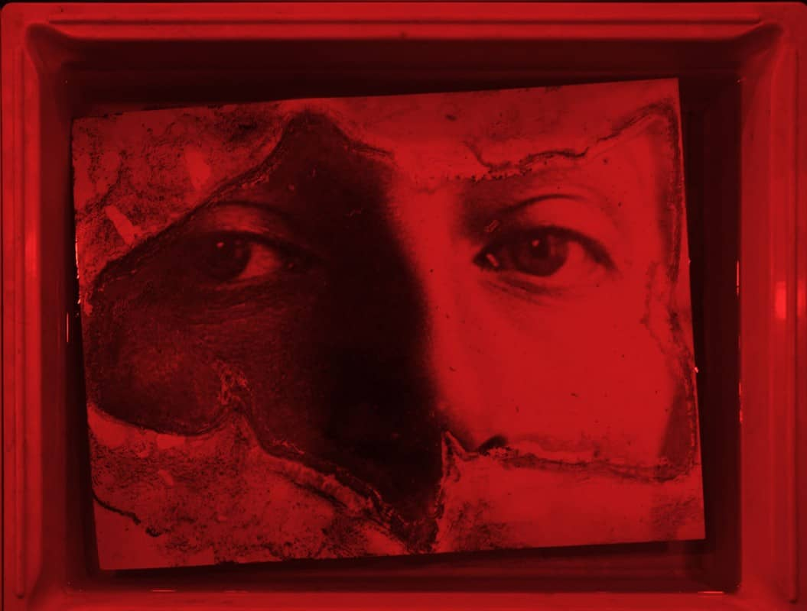

1944’te babası tarafından Macar doğan Alain Fleischer, hayatını imgelerin icadına (sinema, fotoğraf, enstalasyonlar) adamadan önce edebiyat, dilbilim, göstergebilim ve antropoloji okudu.

Yazar, film yapımcısı, sanatçı ve fotoğrafçı olan Alain Fleischer, Paris, Roma ve Tourcoing şehirleri  arasında yaşamakta ve çalışmaktadır.Çeşitli üniversitelerde sanat, sinema ve fotoğrafçılık okullarında ders vermiş, Fransa’da ve yurt dışında çok sayıda ustalık sınıfına liderlik etmiştir.

## Yaptığı Çalışmalar

Sanatçı ve fotoğrafçı olarak çalışmaları düzenli olarak Fransa’da ve yurt dışında kişisel ve karma sergilerde sergilenmiş ve 2003 yılında **Maison Européenne de la Photographie ve Centre Pompidou’da** katalog yayınına eşlik eden bir retrospektif konusu olmuştur. Uluslararası Sidney Bienallerinde (Avustralya), Kwang-ju ve Busan'da (Kore), Havana'da (Küba) Fransa'yı temsil etti. Uzun metrajı filmler, deneysel sinema ve sanat belgeselleri kadar çeşitli türlerde yaklaşık 150 filmin yönetmenidir.

Filmleri Cannes, Berlin, Rotterdam, New York, Montreal, Venedik ve Locarno gibi birçok uluslararası festivalde gösterildi. **2002’de kendisini onurlandıran Montreal’deki Uluslararası Sanat Filmleri Festivali’nde iki kez ödül aldı.** Aynı zamanda elli roman, kısa öykü koleksiyonları, fotoğraf ve sinema üzerine denemelerin de yazarıdır. Paris III Üniversitesi, Montreal Quebec Üniversitesi ve çeşitli görsel sanatlar ve sinema okullarında öğretmenlik yaptıktan sonra, Kültür Bakanlığı tarafından yönetmenliğini üstlendiği Le Fresnoy - Studio ulusal des arts çağdaşlarını kurması için görevlendirildi. Şu an 77 yaşında olan Alain Fleischer, 1997'den beri de bu görevle uğraşmaktadır.

Tekrar görüşmek üzere, saygılarımla...

Kaynakça: [nishgt-posts archive](https://github.com/nishgt/nishgt-posts/blob/master/2021-04-11-alain-%20fleischer/kaynakca.txt)

Özlem Uçkun