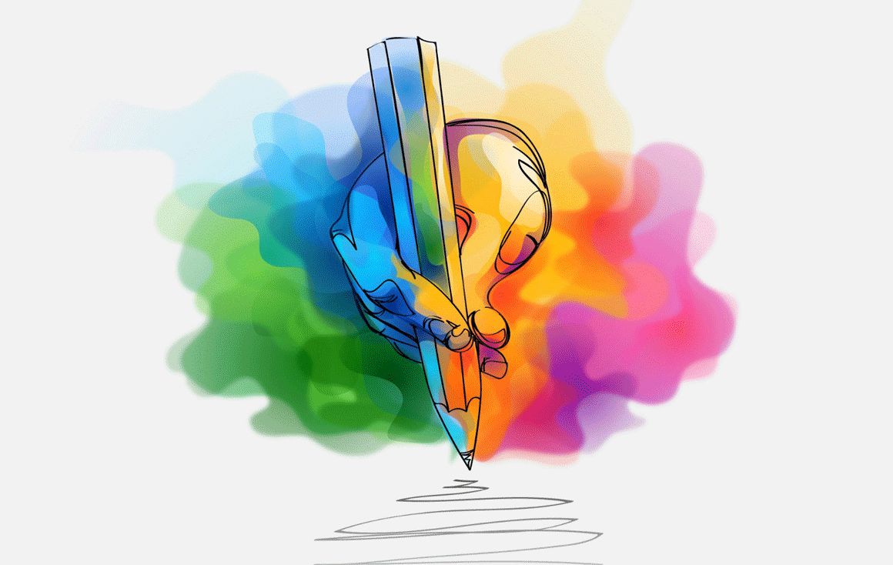
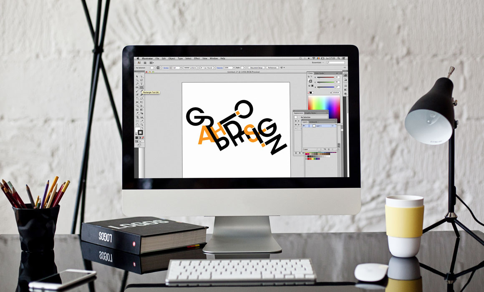

**Grafik Tasarım**, görsel öğeler ile yazıyı kullanarak izleyici etkilemek ve belli bir mesajı belli bir kitleye iletmek amacı ile oluşturulmuş her türlü tasarımı kapsayan bir tasarım dalıdır. **Grafik tasarım, görsel bir iletişim sanatıdır.** Grafik tasarımda görsel unsurlar kenar çizgileri ile aynı yönde yerleştirildiklerinde düzenli ve durağan, karşıt yönde yerleştirildiklerinde dinamik ve enerjik bir yapı oluştururlar.

Yaratıcılığın ve hayal gücünün, teknoloji ile kesiştiği noktada, ortaya çıkan tüm görsellerin içerisinde grafik bulunur. Grafik tasarımı iletilmek istenen bir mesajın eldeki objeler kullanılarak belirli bir düzen içinde birleştirilip iletilmek istenen kişiye ulaştırmaya hazır hale getirilmesidir.

Günümüzde, tüm sektörlerin vazgeçilmezi olan reklâm üretiminde kullandıkları en önemli iletişim tasarım dallarından biri olan Grafik Tasarım, dergiden, broşüre, afişten, dış – iç büyük cephe çalışmaları (Billboard, Outdoor vb.), Web’e yönelik grafik, resim ve logo çalışmalarına kadar geniş bir yelpazeye hizmet vermektedir.

Görsel sanatlar alanındaki ressam, heykeltıraş gibi meslek mensuplarından biri olan grafikerler, basılması istenen materyali estetik kurallar çerçevesinde baskı için düzenleyen; yazıları ve görsel unsurları işin niteliğine uygun bir grafik dili kullanarak çekici hale getiren ve bu yolla etkili iletişim ortamı yaratan sanatçılardır. Tasarım yapabilmek için sadece bilgisayar teknolojisini ve gerekli programları kullanabilmek yetmemektedir. Grafik tasarımcısının desen gücünü, renk bilgisini ve yaratıcılığını teknolojiyle buluşturması gerekir. İletişim, grafik tasarımın hayati unsurudur. Zaten, grafik tasarımını bu denli ilginç, dinamik ve çağdaş kılan şey de iletişime yönelik olmasıdır. Tasarımcı; güncel bir bilgiyi, çağdaş bir beğeni anlayışı içinde ve yine çağdaş araç ve malzemelerle sunmak zorundadır. Bu nedenle de yeni eğilimleri, teknolojik buluşları ve yaşadığı dönem içinde tartışılan sanatsal, felsefi, politik, sosyolojik vb. sorunları yakından izlemelidir.

## Grafik Tasarım Nasıl Yapılmaktadır?

Grafik tasarımı yapabilmek için çok sayıda değişik program kullanmak mümkündür. Grafik tasarımı sadece logo tasarlama anlamına gelmez. Birçok farklı program kullanarak çok sayıda yaratıcı işlemlere imza atılabilir. Bir grafik tasarım uzmanının kullanmış olduğu en önemli program Photoshop’tur. Web tasarım aşamasının temellerini bu program sayesinde öğrenmek gayet mümkündür. Corel programı yine grafik tasarım alanında kullanılan en özenli program arasında yer almaktadır. Bunun haricinde Flash ve Fireworks gibi programlar da kullanabilmek mümkündür.

İlk aşamada Photoshop programını iyice öğrenmek gerekmektedir. Photoshop programı en çok grafik tasarımı ve fotoğrafçılık alanlarında kullanılmaktadır. Fotoğrafçılık alanında kullananlara çok daha fazla stil gerekmektedir. Grafik tasarımcılar ise yazı fontunu daha fazla kullanırlar. 

Corel ise grafik tasarım alanının ana programları arasında yer alır. Corel Draw; tasarımcıların logo, afiş, kartvizit ve reklam panosu gibi tasarımları yapabilmesi için çizim aşamalarında kullanılmaktadır. 

Adobe Illustrator ise yine grafik tasarım alanında kullanılan vektörel bağlantıları bulunan bir çizim programıdır. Kullanma şekli oldukça basittir. Adobe Illustrator programı genellikle baskılarda kullanılmaktadır. Kitap, el ilanı, gazete, dergi, kartvizit ve broşür gibi çalışmalar Adobe Illustrator programı yardımı ile hazırlanmaktadır. Oldukça gelişmiş bir vektörel alt yapıya sahip olduğu için genellikle profesyonel tasarımcılar tarafından tercih edilmektedir. Aynı bilgisayar menüsü gibi oldukça basit bir kullanım arayüzüne sahiptir. Bu menüleri kullanarak dosyalarını kolay bir şekilde yönetebilir ve kullanmak istediğiniz amaç doğrultusunda düzen oluşturabilirsiniz.

## Grafik Tasarım Hangi Alanlarda Kullanılır?

Grafik tasarımı eğitimi alan kişiler görüldüğü gibi çok geniş bir yelpazede iş bulma imkanına sahiptir. Genellikle grafik tasarımcılar reklam sektöründe iş bulabilirler. Gazete, dergi, internet ortamlarında etkili mesajları iletmek için, web tasarımı ve logo tasarımı yapmak için, etkili görsel reklamlar oluşturmak için grafik tasarımcılara ihtiyaç duyulur.

Dijital ortamlarda grafik tasarımcıların çalışabileceği birçok alan bulunur. Özellikle internet sitelerinde kesinlikle grafik tasarımcılara ihtiyaç vardır. Özellikle sosyal medyanın gelişmesi ve büyük kitlelere hitap etmesi nedeni ile büyük firmalar sosyal medya hesaplarında özel tasarım gönderiler yayımlamak için grafik tasarımcıları tercih ederler. Bunun yanı sıra internet sitesi tasarımları ve marka logo tasarımlarında da yer alan grafikerler, site içi görselleri oluşturabilir.

Baskı merkezlerinde de grafik tasarımcılar tercih edilebilir. Basılı el ilanları, ürün katalogları, ürün bültenleri, tanıtım bültenleri, afişler ve reklam görselleri gibi birçok materyal grafik tasarımcılar tarafından hazırlanır. Dijital baskı ve dijital tabloların yapılmasında da grafik tasarımcılar tercih edilebilir.

Yeniden görüşmek dileğiyle, sağlıcakla kalın.

Kaynakça: [nishgt-posts archive](https://github.com/nishgt/nishgt-posts/blob/master/2021-05-26-grafik-tasarim-nedir/kaynakca.txt)

Özlem Uçkun
