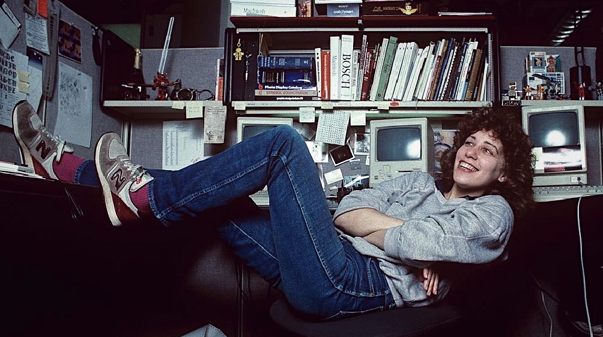
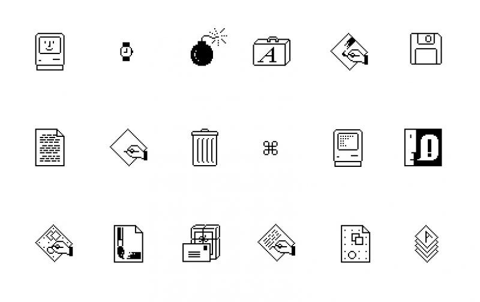

Susan Kare, 1980'lerde Apple Macintosh için arayüz öğelerinin çoğunu yaratan bir sanatçı ve grafik tasarımcısıdır. Aynı zamanda NeXT'nin Kreatif Direktör olarak çalışan orijinal çalışanlarından biriydi.
Kare, 1954’te New York'ta doğmuş, roket bilimcisi Jordin Kare'nin kız kardeşidir. 1971'de Harriton Lisesi'nden mezun oldu, 1975'te Mount Holyoke Koleji'nden Sanat dalında doktora derecesini aldı. 1978'de New York Üniversitesi'nden mezun oldu. Daha sonra San Francisco'ya taşındı ve bir sanat müzesinde çalıştı. 

Kare, 1980'lerin başında lise arkadaşı Andy Hertzfeld'den bir telefon aldıktan sonra Apple Computer, Inc.'e katıldı. Esas olarak unvanının *"Macintosh Sanatçısı"* olduğu Macintosh Yazılım Grubunda çalıştı. Ancak, NeXT'ye gitmeden önce kısa bir süre Creative Services'de Kreatif Direktör olarak çalıştı.

Orijinal Macintosh OS için birçok yazı tipinin, ikonun ve orijinal pazarlama materyalinin tasarımcısıdır. Gerçekten de, çığır açan çalışmasının torunları, özellikle Lasso, Grabber ve Paint Bucket gibi ikonlar olmak üzere birçok bilgisayar grafiği araçlarında ve aksesuarlarında hâlâ görülebilir.

Piksel sanatının ilk öncülerinden biri olan Apple ile geçirdiği zamanın en tanınmış eserleri Chicago yazı biçimi, Cenevre yazı tipi, Clarus the Dogcow, Happy Mac (Mac kullanıcılarını, makinelerini 18 yıldır başlattıklarında Mac OS X 10.2'nin yerini gri bir Apple logosuyla değiştirene kadar karşılayan gülümseyen bilgisayar) ve Command tuşunun üzerindeki sembol Apple klavyelerdir.

## "Mutlu Mac"

Apple için tasarım yaparken aklında bir hedefi vardı. Macintosh'u insancıllaştırmak istiyordu, soğuk bir makineden çok daha sıcak ve arkadaş canlısı / yaklaşılabilir görünüyordu. Dolayısıyla, Apple'da geçirdiği dönemde yarattığı sembolik temsilin en ikonik biçimlerinden biri olan **"gülümseme".**

***“Mutlu Mac, gülen suratlı bu düğmelerden 14 yaşındaki aşkımdan geldi. Dostça davranma iznimiz vardı. Bu özetin bir parçasıydı. İşleri dostane ve insancıl kılmayı seviyorum. Bunu çok zevkli buluyorum. " - Kare***

Susan tasarımların basit, minimal ve göz alıcı olmasını sağladı.
2018'de bir **AIGA madalyası** ile ödüllendirildi ve onu en üst düzey tasarımcılar kulübüne koydu.
Apple ile yaptığı projeden sonra IBM, Microsoft, Facebook ve daha fazlası gibi teknoloji devleriyle çalışmaya devam etti ve bu ona Cooper Hewitt, Smithsonian Tasarım Müzesi'nden Yaşam Boyu Başarı Ödülü'nü kazandırdı.

New York City'deki Museum of Modern Art mağazası, kırtasiye malzemeleri ve tasarımlarının yer aldığı defterler taşımaya başladı. 7 Şubat 2007'den itibaren popüler sosyal ağ sitesi Facebook'un "Hediyeler" özelliği için simgeler üretti. Hediye satışlarından elde edilen kar, meme kanserine karşı mücadele için Cure vakfı için Susan G. Komen'e bağışlandı.

Kare, mühendisler için özel bir alan olan teknoloji endüstrisi klişesine karşı koymaya çalıştı ve dışarıdaki tüm grafik tasarımcılara ilham kaynağı oldu.

Yepyeni bir yazı ile sizlerleydim. Tekrar görüşmek üzere...

Kaynakça: [nishgt-posts archive](https://github.com/nishgt/nishgt-posts/blob/master/2021-05-28-susan-kare-kimdir/kaynakca.txt)

Özlem Uçkun
