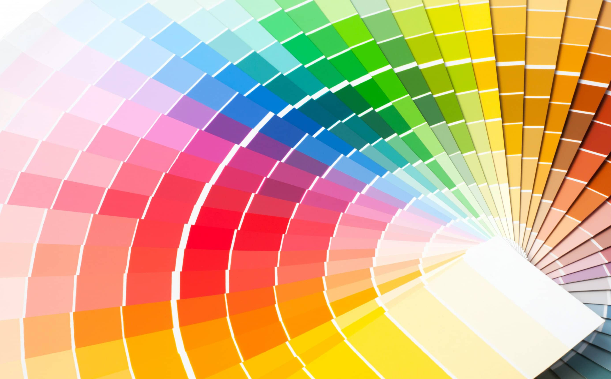
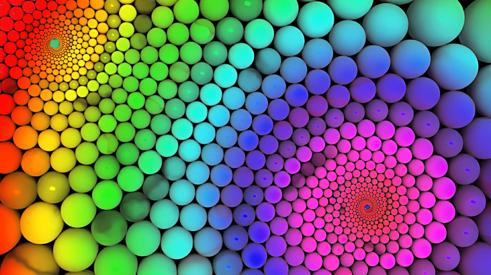

## Renk nedir sorusuyla başlayalım

Renk, algılama ile ilgili bir olgudur. Renkler, ışığın nesneler üzerine çarparak gözün retinasına ulaşması ile ortaya çıkar.

Aslında renkler sandığımızdan daha çok etkiler bizleri. Birçok araştırmaya göre renklerin insan üzerinde psikolojik etkileri vardır. Bazı renkler diğerlerine göre daha kolay fark edilir, dikkat çeker ve psikolojimiz üzerindeki etkileri daha baskındır. Kimi renkler fizyolojik olarak veya psikolojik olarak bizi daha çok etkiler.

Tasarımcılar için yaratmanın ve etkilemenin yolu renklerden geçer. İyi tasarımcılar renk uyumları ve renk anlamlarını fazlasıyla önemser. Ve tasarımlarını bu doğrultuda yürütürler.

Hadi gelin renklerin anlamlarına birlikte bakalım.

## Beyaz Rengin Anlamı

Beyaz renk, sadeliği, saflığı, masumiyeti ve barışı simgelemektedir. Tüm renklerin pozitif ve negatif yönünü dengeleme unsuru olarak kullanılır. Beyaz renk, düşüncelerinizin ve duygularınızın temizlenme görevini görürken, aynı zamanda da tüm enerjinizi artırma görevini üstlenir. Günümüzde mimaride de oldukça sık kullanılan beyaz, ferah ve iç açıcı bir renktir.

## Siyah Rengin Anlamı

Siyah aslında oldukça geniş bir anlama sahiptir. Güç, asillik, disiplin, öz güven ve kudreti temsil etmesinin yanı sıra, karanlığı, suçu, gizemi ve kötüyü de temsil eder.

## Kırmızı Rengin Anlamı

Kırmızı aşk ve tutkunun rengi olarak bilinir. Heyecan verici bir renk olan kırmızı, dikkat çekici ve harekete geçiricidir. Acıktırıcı ve çabuk karar aldırma hissiyatı ile yemek sektörünün vazgeçilmez rengi olarak da bilinir.

## Mavi Rengin Anlamı

Freud maviyi okyanusa benzetir. Dinginliği, sakinliği,yalnızlığı ve depresyonu da temsil eder. Koyu mavi ise çoğu zaman güvenilirliği ile ön plandadır.

## Yeşil Rengin Anlamı

Yeşil rengi doğayı, yenilenmeyi, pozitifliği, Kendini sevmeyi çağrıştırır. Yeşil rengi insanların kendini mutlu ve pozitif hissetmesini sağlar, hayatında yeşile önem veren insanlar çevresiyle uyumlu ve sevecen insanlar olarak bilinirler.

## Sarı Rengin Anlamı

Sarı rengi, verimliliği ve üretkenliği olumlu olarak etkiler. Bu özelliği sayesinde, yaratıcı tarafı daha baskın olan kişilerin favori rengidir. Mutluluk ve güneş ile ilişkilidir. Tasarımlarınız da sarıyı kullanmak, mutluluk ve neşe duygusu verebilir. Aynı zamanda geçiciliği temsil eden sarı renginin taksilerde kullanıldığını görürüz.

## Mor Rengin Anlamı

Mor rengi kırmızı ve mavinin karışımı olan bir renktir ve her ikisinden de biraz özellikler almıştır. Zenginlik, asalet ve gösterişi simgelediği için krallık ve imparatorlukların rengi olarak bilinir. Bir diğeri ise uyku problemi çeken kişiler tarafından sıklıkla kullanılır. Bunun nedeni ise uyku getirici etkiye sahip olmasıdır. Aynı zamanda, mor renginin hayal gücü artırma etkisi de vardır.

## Turuncu Rengin Anlamı

Dışa dönük bir renktir turuncu. Mutluluk ve dinamizm yayan aynı zamanda pozitif enerji yayan çarpıcı ve iç açıcı bir renktir. Turuncu renginin canlılık, neşe, gösteriş ve şatafatın rengi olduğundan hayatı ve yaşamayı seven kişilerin rengi olduğu söylenir. Kırmızıya dönük bir turuncu ise sinir ve öfkeyi temsil eder.

## Pembe Rengin Anlamı

Pembe rengi belkide insanlar arasında en sevecen olarak görülen renktir. Dinginlik ve huzur veren pembe sinirli bir kişinin sakinleşmesinde yardımcı olur. Hostesler genellikle pembe kıyafetler tercih eder.

Bugün sizlere renklerin insanlar üzerindeki etkilerin bahsettim. Bir diğer yazımda görüşmek dileğiyle.

Kaynakça: [nishgt-posts archive](https://github.com/nishgt/nishgt-posts/blob/master/2021-05-31-renklerin-anlamlari/kaynakca.txt)

Kardelen Büyük